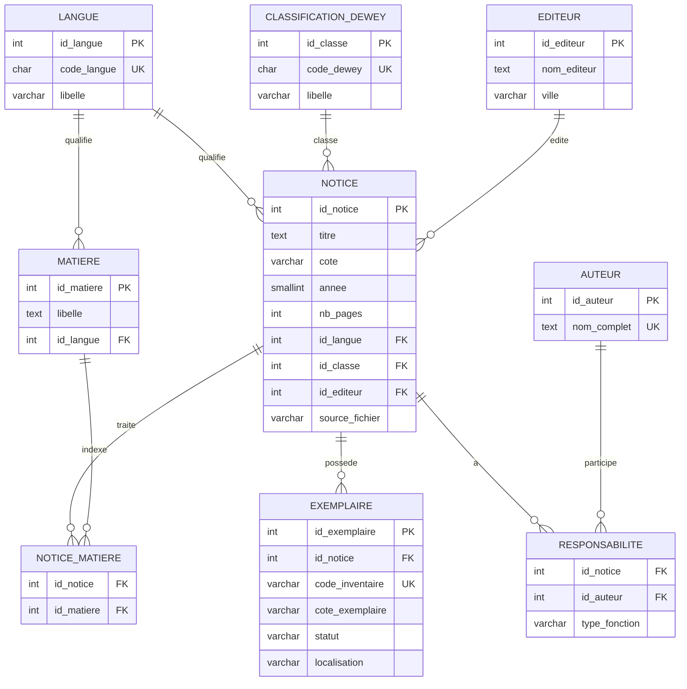

# MCD / MLD du SIGB

Ce document complete le rapport principal avec une vue claire du modele retenu pour integrer `buf.csv` et `bua.xls`.

## Choix de modelisation

- Une `notice` decrit l'ouvrage : titre, annee, pages, langue, editeur, classification.
- Un `exemplaire` represente la copie physique : inventaire, cote, statut, localisation.
- Les `auteur`, `editeur` et `matiere` sont normalises pour eviter la repetition.
- `responsabilite` materialise la relation N:M entre notices et auteurs.
- `notice_matiere` materialise la relation N:M entre notices et matieres.

## MCD Simplifie

## MLD Relationnel

- `langue(id_langue, code_langue, libelle)`
- `classification_dewey(id_classe, code_dewey, libelle)`
- `editeur(id_editeur, nom_editeur, ville)` avec unicite `(nom_editeur, ville)`
- `notice(id_notice, titre, cote, annee, nb_pages, id_langue, id_classe, id_editeur, source_fichier, date_creation)`
- `exemplaire(id_exemplaire, id_notice, code_inventaire, cote_exemplaire, statut, localisation, date_entree)`
- `auteur(id_auteur, nom_complet)`
- `responsabilite(id_notice, id_auteur, type_fonction)`
- `matiere(id_matiere, libelle, id_langue)`
- `notice_matiere(id_notice, id_matiere)`

## Correspondance Sources / Tables

| Champ source | Table cible | Champ cible |
|---|---|---|
| Cote | `notice`, `exemplaire` | `cote`, `cote_exemplaire` |
| Titre | `notice` | `titre` |
| Auteur | `auteur`, `responsabilite` | `nom_complet`, lien N:M |
| Lieu | `editeur` | `ville` |
| Edition | `editeur` | `nom_editeur` |
| Annee | `notice` | `annee` |
| Nb pages | `notice` | `nb_pages` |
| Matiere | `matiere`, `notice_matiere` | `libelle`, lien N:M |
| Inventaire | `exemplaire` | `code_inventaire` |
